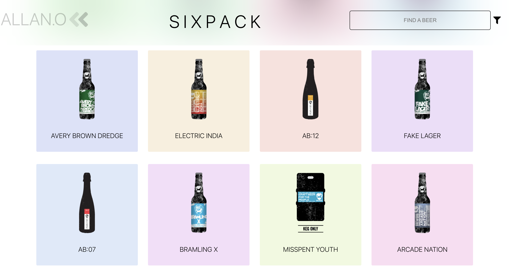

# Six-Pack

<p align="center">
  
</p>

### This aesthetic reactJS web-app makes use of Brewdog's catalogue of DIY dog beers using the punk API. It allows users to search through an assortment of over 75 different beers, and provides information about each on an easy to read card. Additionally, users can also filter and search through beers by ABV > 6%, high acidity beers (ph < 4), and pre-2010 brews.

## Description

The purpose of this app is to provide users with an easy to read, and informative way to view the different beers available to them from the Brewdog API. The cards are displayed in a grid format, which allows the user to scroll through each card, and view the information about each beer when clicked.

---

<p align="center">
  
</p>

---

| Table of Contents               |
| ------------------------------- |
| [User Story](#UserStory)        |
| [Functionality](#Functionality) |
| [Technology](#Technology)       |
| [License](#License)             |
| [Contributors](#Contributors)   |
| [Links](#Links)                 |

---

## User Story

-   **As a player I would like to search, filter through and read information from a menu of beers**
-   Given that I click on a beer card, I would like to be able to see the information about that beer (including acidity, ABV, and when it was brewed)
-   Given that I click on a filter, I should only see all beers that meet the criteria of the filter before searching
-   Given that I do not select a filter, I should be able to see all beers before searching
-   When I type into the searchbar AND have a filter selected, I should be able to search through ONLY the beers that meet the criteria of the filter.
-   When I type into the searchbar AND no filter is selected, I should be able to search through every single beer from Brewdog's punk api.

## Functionality

The two most vital parts of this app are the filter and the search functionality, because they
determine the arrays of beers which can be sort through by the user. For this to happen, the beer array must be retrieved from
the API. This is performed within the beer.service.js file where API requests (according to Brewdog documentation) are made by the
requestBeers function, depending on the string parameter inputted into the function.

```js
/*
The getBeers function which retrieves arrays
*/
const getBeers = async (filter) => {
    const beerArray = await requestBeers(filter);

    return !filter
        ? await requestBeers("none")
        : filter === "acidity"
        ? await requestBeers("none")
        : beerArray;
};
```

The requestBeers procedure is used in the getBeers function for readability into the getBeers function which is exported to the main app file. Becuase there is no request which can be made to the API to produce an array of acidic beers, the getBeers function does this simply by filtering the entire catalogue of beers for beers with a ph under 4, and then returning the result.

The getBeers function is used to provide the beer array which will be filtered through by the search function optimizeBeerSelection. It is defined in the root app component and then passed down as props to the searchbar component.

```js
/*
The getBeers function which retrieves arrays
*/
const optimizeBeerSelection = async (input) => {
    const currentArray = await getBeers(filter);
    setBeers(
        currentArray.filter((beer) =>
            beer.name.toLowerCase().includes(input.toLowerCase()),
        ),
    );
};
```

On user input (in the searchBar) the optimizeBeerSelection function will filter the current array as determined by getBeers for characters which match the inputted string. It will then use react useState to set the beers array. The beers array is then passed down to the card list for the user to view and interact with.

-There is more info in the main.js file!

## Technology

-   React.js
-   Node.js
-   Sass
-   Brewdog Punk API
-   React Hooks (for state management)

## License

[](https://opensource.org/licenses/MIT)

## Future Developments

-   Card overlay, to avoid shifting of other elements when a beer card is expanded
-   Intergration with other APIs for a wider selection of beers and beverages.
-   A 'beer of the day' feature
-   Refactoring of code, for readability and reusability and componenent testing with React Testing Library & Enzyme

## Contributions

This was a solo project :)

## Links

#### Github Repo

https://github.com/A11AN0/Sixpack

#### Deployed App

https://a11an0.github.io/Sixpack/

#### Thanks for reading!-Allan :)
